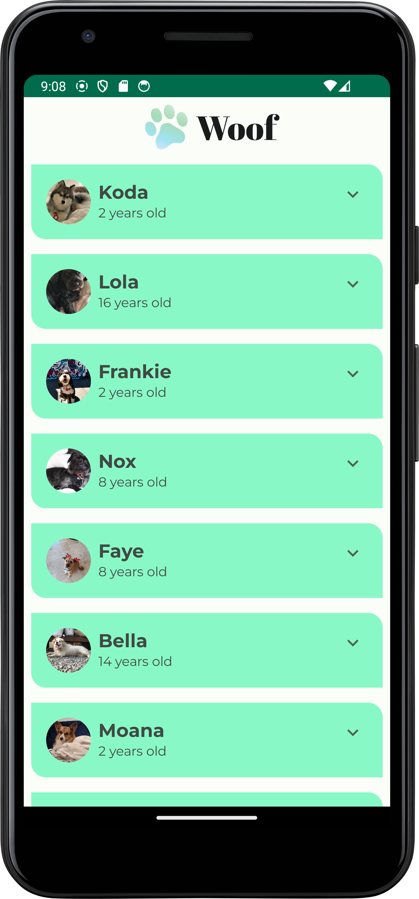
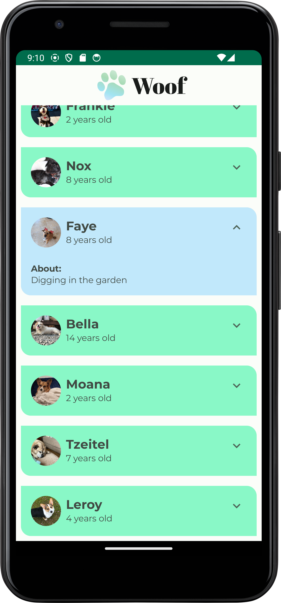
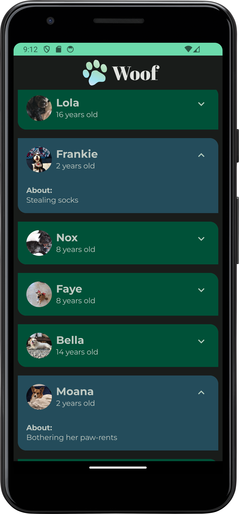

# Woof App

A simple Android app built using **Kotlin**, **Jetpack Compose**, and **Material Design** that displays a list of dogs along with details such as name, age, and hobbies. The app supports both **light** and **dark themes** and uses animations to enhance the user experience.

## Challenges Faced / Key Learnings

- **Implementing LazyColumn**: One of the key challenges was efficiently displaying a list of dogs with their details. I learned to use **LazyColumn** to improve performance by recycling views as users scroll through the list And how to get data from a DataSource to a lazyColumn List.

- **State Management**: Managing the app’s state using Jetpack Compose's `remember` and `mutableStateOf` was crucial for handling UI updates efficiently. This was a key learning, as I had to ensure smooth interactions without unnecessary recompositions.

- **Card Composables**: I used **Card Composables** to display each dog's information in a neat, visually appealing format. Learning how to design these cards effectively using **Material Design** components allowed me to make the UI more structured and aesthetically pleasing. I also explored **shadows**, **elevations**, and **rounded corners** to enhance the look and feel of the app.

- **Theme Switching**: Implementing light and dark modes with **Material Design** components was a challenge, especially ensuring that all components switched correctly based on the system's theme. I gained valuable experience in applying global theming and working with theming APIs in Jetpack Compose such as defining app colors , fonts , typography etc.

- **Animations**: Adding animations to enhance user interaction was both a fun and challenging task.Used Spring animation for expansion using animateContentSize Modifier and also animated Color as a state.
  
- **TopAppBar**: Also Learned how to add a Top App Bar using Jetpack Compose

## Screenshots

### Light and Dark Mode
The app supports both light and dark themes.






## Installation

### Prerequisites
- **Android Studio** installed on your machine.
- Android emulator or a physical device for testing.

### How to Run the App

1. Clone the repository:
   ```bash
   git clone https://github.com/Pranav24k/Woof-app-Practice.git
